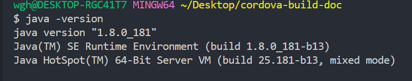
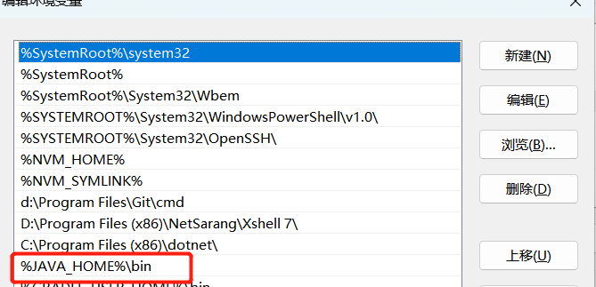
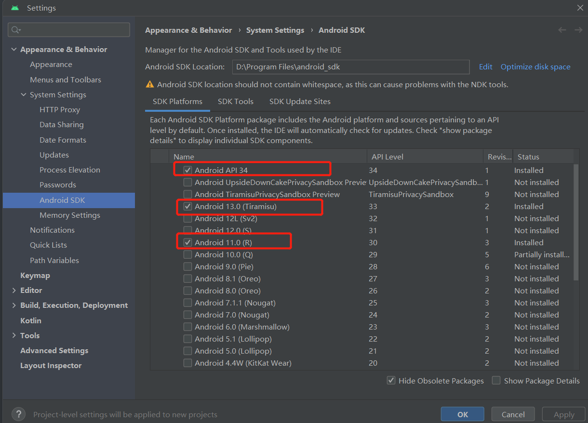
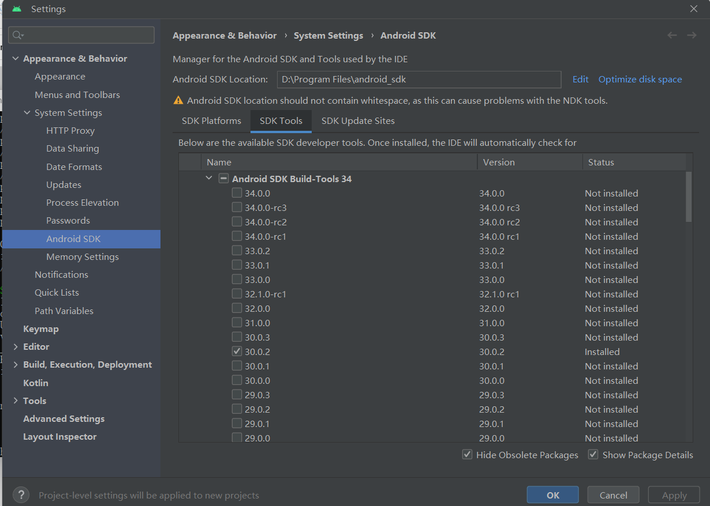
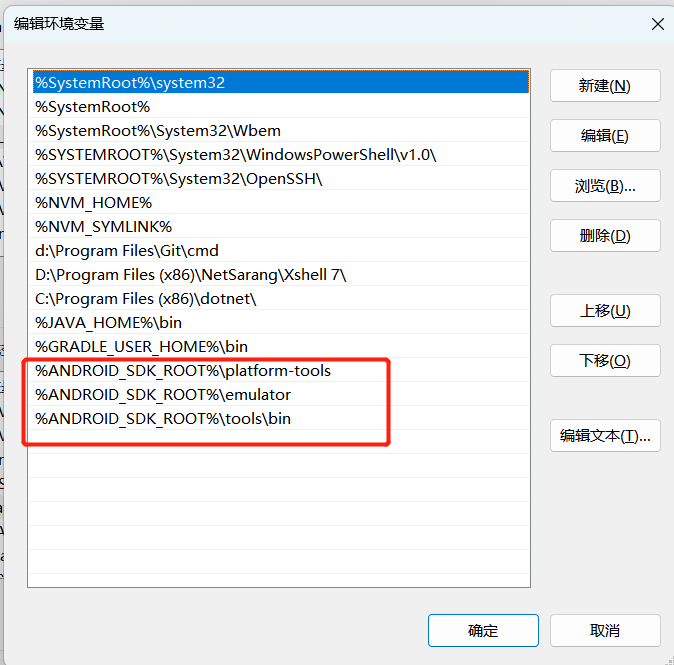
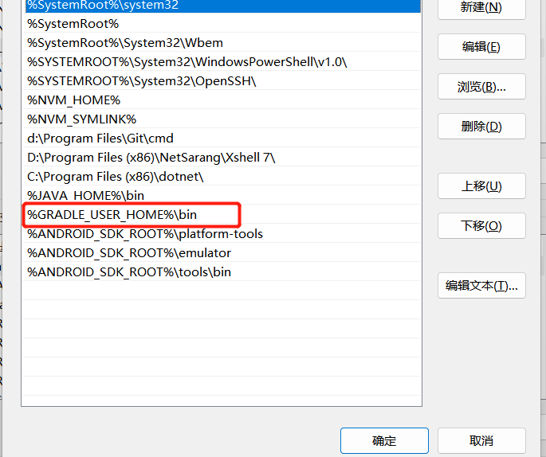

## 1. 安装node

## 2. 安装java

> 目前我用的版本是1.8



- 配置环境变量

  > 变量名：JAVA_HOME
  > 
  > 变量名：D:\Program Files\Java\jdk1.8.0_181

   > 变量名：CLASSPATH
  > 
  > 变量名：.
  - 将JAVA_HOME 添加到Path路径中
  

## 3.安装android studio

	- 下载 sdk platforms




- 下载sdk tools




  - 配置环境变量

    <font color="red">备注：ANDROID_HOME和 ANDROID_SDK_ROOT  对应的值是一样的 </font>
    
    > 变量名：ANDROID_HOME
    >
    > 变量值：D:\Program Files\android_sdk

    > 变量名：ANDROID_SDK_ROOT
    >
    > 变量值：D:\Program Files\android_sdk

    <font color="red">	备注：D:\Program Files\android_sdk 路径是上面安装sdk 工具所配置的路径</font>

    - 将ANDROID_HOME和 ANDROID_SDK_ROOT配置到Path路径中

    


> %ANDROID_SDK_ROOT%\platform-tools
> %ANDROID_SDK_ROOT%\emulator
> %ANDROID_SDK_ROOT%\tools\bin
>


- 下载 gradle

  下载地址 : https://services.gradle.org/distributions/

> 我下载的是 6.5.1 ,不要下载过高的版本，会出现一些不可预测的错误。

 - 配置环境变量

> 变量名：GRADLE_USER_HOME
>
> 变量值：D:\Program Files\android_sdk


​	

>  %GRADLE_USER_HOME%\bin

## 4. 安装 cordova

​	我没有安装最新版本，因为我看别的up主安装gradle6.5和cordova版本是10，有兴趣可以尝试一下别的版本哦！

  ``` cmd
    npm install -g cordova@10
  ```


 - 创建项目

  > 输入创建命令：cordova create 项目名称 io.cordova.项目名称 项目名称

  ``` cmd
    cordova create hello io.cordova.hello hello 
  ```
  - 进入到hello项目中 

  - 安装平台

  ``` cmd
    cordova platform add android // 安装安卓平台
    cordova platform add brower // 安装浏览器平台
  ```

  - 打包apk
  ``` cmd
    cordova build android
  ```

​		   打包成功后 ,包的地址：C:\Users\wgh\Desktop\hello\platforms\android\app\build\outputs\apk\debug\app-debug.apk


